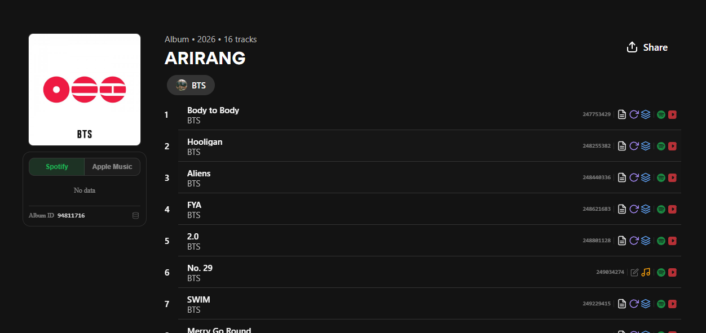
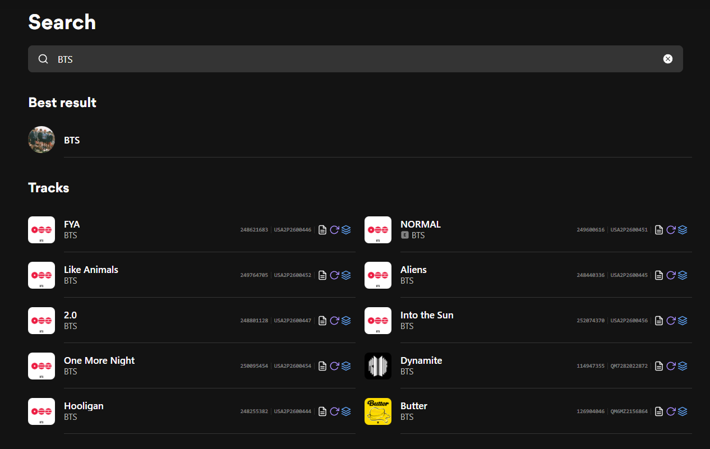
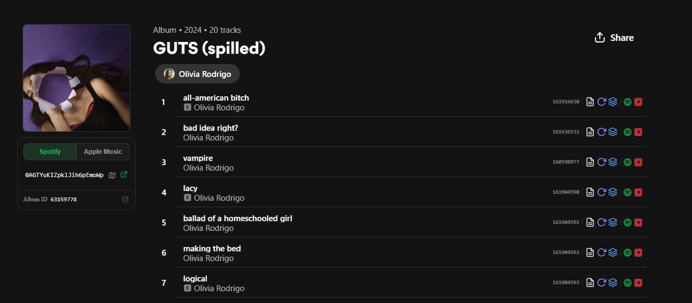
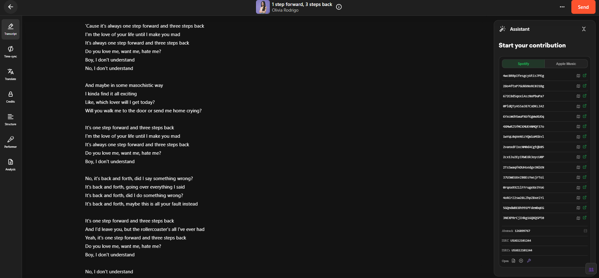

# Musixmatch Power Enhancer

A Tampermonkey userscript that enhances [Musixmatch](https://www.musixmatch.com) with source IDs, track metadata badges, Curators shortcuts, and search overlays.

## Features

**Album panel** — `/album/` pages on `www.musixmatch.com` (below cover art):

- **Connected sources** — shows Spotify, Apple Music, and Amazon Music IDs linked to the album, with one-click copy
- **Availability map** — map icon next to each Spotify ID opens [Spotify Availability Map](https://spotify-availability-map.com) for the album
- **Album ID** — displays the Musixmatch album ID in the footer; click to copy
- **Release date** — appends the formatted album release date to the metadata line (e.g. `Single • 2019 • 1 track • Nov 23, 2019`)

**Per-track badges** — injected into every track row on `/album/` pages:

- **Abstrack** — displays the common track ID next to each row
- **Content flags** — icon badges shown only when true: Lyrics, Synced, Track structure, Instrumental
- **Service links** — direct Spotify and Apple Music track links
- **Add lyrics** — quick link to the Curators editor for tracks without lyrics

**Track panel** — `/lyrics/` pages on `www.musixmatch.com` (below the Contribute widget):

- **Connected sources** — shows Spotify and Apple Music IDs linked to the track, with one-click copy
- **Availability map** — map icon next to each Spotify ID opens [Spotify Availability Map](https://spotify-availability-map.com) for the track
- **Abstrack** — displays the common track ID in the footer; click to copy
- **Release date** — chip in the track stats row (next to contributions / last activity), formatted from `releaseDate`
- **Last edit date** — chip in the same stats row, formatted from `lastEditDate`

**Artist panel** — `/artist/` pages on `www.musixmatch.com` (below the Leaderboard section):

- **Connected sources** — shows Spotify and Apple Music IDs linked to the artist, with one-click copy
- **Artist ID** — displays the internal Musixmatch artist ID in the footer; click to copy

**Search panel** — `/search` pages on `www.musixmatch.com`:

- **Per-track badges** — injected into every track row in search results:
  - **Abstrack** — displays the common track ID next to each row
  - **ISRC** — displays the primary ISRC (if available) next to the row
  - **Content flags** — icon badges shown only when true: Lyrics, Synced, Track structure

**Editor panel** — `curators.musixmatch.com` (below Format Suggestions):

- **Connected sources** — shows Spotify and Apple Music track IDs intercepted from the `track.get` API response, with one-click copy and direct service links
- **Abstrack** — displays the common track ID in the footer; click to copy
- **ISRC** — displays the primary ISRC; click to copy
- **ISRCs** — displays all ISRCs linked to the track; click to copy
- **Published state** — displays the track's current publish and lock status (e.g., verified, locked for specs)
- **Quick links** — shortcuts to open the track's lyrics, album, or Curators Tool directly
- **Drafts manager** — adds a floppy disk icon to the top bar, allowing you to download all local drafts as a JSON file, or load them to restore or sync drafts across devices (safely bypasses Musixmatch expiration)
- **Scrollbar styling** — applies a slim, subtle scrollbar style globally across the entire `curators.musixmatch.com` page

**General**:

- **Hover tooltips** — all icons and interactive elements show a tooltip on hover
- **SPA navigation** — works across Next.js client-side navigations without page reloads

## Installation

1. Install [Tampermonkey](https://www.tampermonkey.net/) for your browser
2. Click the button below to install the script directly

## Preview

### Album View

### Search View

### Track View

### Curators View

## Support

- Report bugs: [GitHub Issues](https://github.com/mxm-enhancer/mxm-enhancer/issues)

---

_Independent project — not created by, sponsored by, or connected to Musixmatch._
